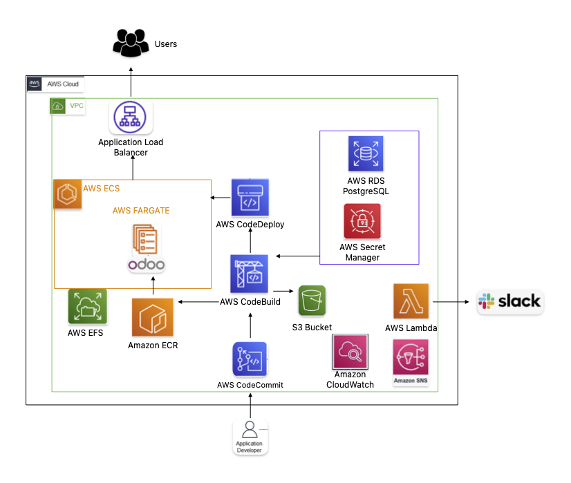

<h1 align="center"> Implementación CI/CD Odoo 17 con AWS services </h1>
<h3 align="center"> By Alexis Jose & Gastón Pauletti </h3>
<h3 align="center"> Track0 - DevOps </h3>
<h3 align="center">  Fundación MIRGOR </h3>

<h2>Descripción general </h2>

Esta plantilla de CloudFormation despliega Odoo 17 con base de datos AWS RDS PostgreSQL en ECS Fargate para la gestión de contenedores y EFS para el almacenamiento de archivos. 

<h2> Arquitectura </h2>

<h4>Implementacion:</h4>

- Clonar el Repositorio:
git clone https://git-codecommit.us-east-1.amazonaws.com/v1/repos/odoo-test-g3

- Desplegar plantilla AWS CloudFormation 
    - odoo-extra-g3-pipeline.yml
 

- Una vez desplegado, acceder a través de la URL del balanceador de carga:
    - ALB-G3-extra-6904420.us-east-1.elb.amazonaws.com
- Acceder a Odoo con las credenciales enviados por email.

<h4>RECURSOS CREADOS:</h4>

- Manejo de claves con Secrets Manager
- Base de datos RDS PostgresSQL
- Persistencia con sistema de archivos EFS - Access Point.
- Gestion de contenedores ECS Fargate con imagen de Odoo 17.
- Balanceador de carga con conexión a internet, para redirigir el trafico.
- Monitoreo mediante cloudwatch y logs. 
- Implementaciones de seguridad
    - Security Groups 
    - IAM Roles 
    - Policies.
    - VPC
- Notificaciones
    - Las notificaciones se envían mediante un canal de Slack especificado por la URL del webhook.
- Agregar módulos extra en Odoo
    - Descargar y descomprimir paquetes del módulo en la carpeta addons